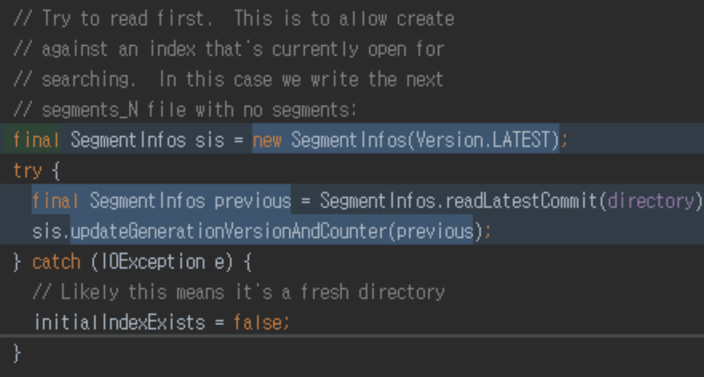
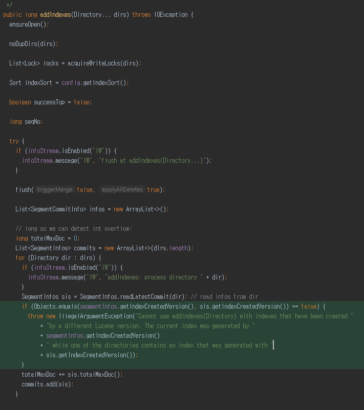
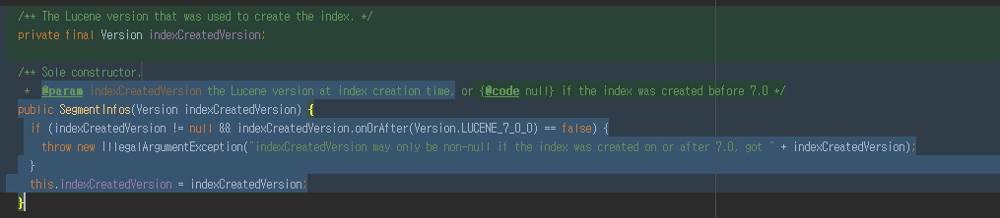
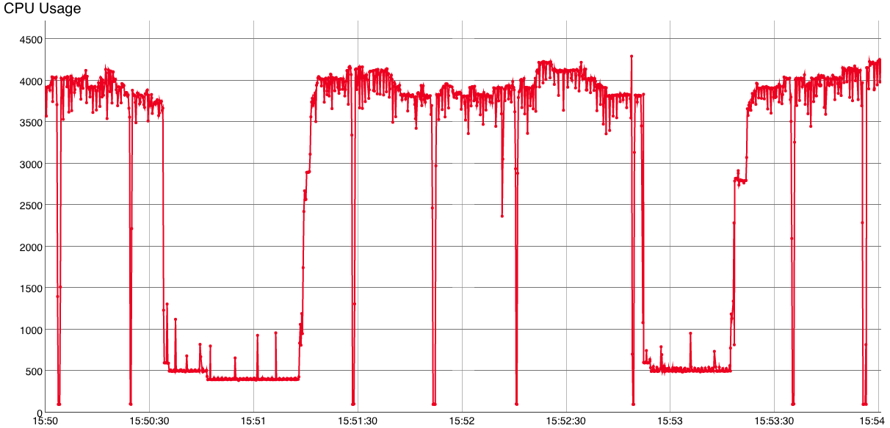
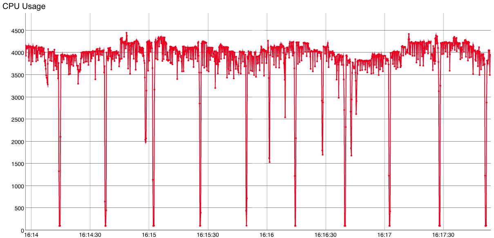

# 루씬 7 변경사항

참고 : https://lucene.apache.org/core/7_0_1/changes/Changes.html#v7.0.0.api_changes

# 시스템 요구사항

Java 8 이상

# 루씬 7 새로운 기능

## LUCENE-7703

* 색인시 루씬 버전이 세그먼트에 기록됨.

* SegmentInfos now record the Lucene version at index creation time.

* All added indexes must have been created by the same Lucene version as this index.

  **IndexWriter.java**

****

Reindex indices from Elasticseach 2.x or before
Indices created in Elasticsearch 2.x or before will need to be reindexed with Elasticsearch 5.x in order to be readable by Elasticsearch 6.x. The easiest way to reindex old indices is to use the reindex API.

**SegmentInfos.java**

****

## LUCENE-7756

*  LeafReader.getMetaData는 인덱스 생성 버전과 세그먼트에 기여한 가장 오래된 Lucene 버전을 공개합니다.

## LUCENE-7854

* 사용자 정의 토큰 스트림으로 분석하는 동안 새로운 TermFrequencyAttribute를 사용하여 사용자 정의 용어 빈도를 인덱싱 할 수 있습니다
* Characters before the delimiter are the "token", the textual integer after is the term frequency.
  To use this TokenFilter the field must be indexed with but no positions or offsets. For example, if the delimiter is '|', then for the string "foo|5", "foo" is the token and "5" is a term frequency. If there is no delimiter, the TokenFilter does not modify the term frequency.
* 각 토큰의 끝에서 구분자 char ( '|') 다음에 숫자 값을 구문 분석하고 용어 빈도를이 값으로 변경합니다.

## LUCENE-7868

* 여러 스레드가 삭제 및 문서 값 업데이트를 동시에 해결할 수 있으므로 업데이트가 많은 인덱싱 사용 사례에서 상당한 속도 향상이 가능합니다

  ****

  ****

## LUCENE-7823

* BM25 점수를 사용하여 순 쿼리 기반 순진 베이지안 분류

## LUCENE-7838

* 퍼지(Fuzzy) 용어 검색어를 기반으로 한 knn 분류 기준 추가 (NearestFuzzyQuery)

## LUCENE-7855

* Wikipedia 토크 나이저의 고급 옵션을 공장에 추가했습니다.
* Wikipedia데이터 형식에 맞춘 토크나이저

# API 변경

## LUCENE-2605

* Classic QueryParser는 더 이상 공백을 기준으로 더 이상 분할하지 않습니다. setSplitOnWhitespace (true)를 사용하여 이전 동작을 가져옵니다.

* queryparser는 공백에 대한 입력을 구문 분석하고 각 공백으로 구분 된 용어를 자체의 독립적 인 토큰 스트림으로 보냅니다.
  이것은 공백 경계를 넘어서서는 볼 수 없기 때문에 질의시 다음의 경우는 문제가 있습니다.

  ~~~
  n-gram 분석
  shingles
  동의어 (특히 공백으로 구분 된 언어의 다중 단어)
  '단어'에 공백이 포함될 수있는 언어 (예 : 베트남어)
  ~~~

  * 사용자가 charfilters / tokenizers / tokenfilters가 index와 querytime에서 동일한 작업을 수행 할 것이라고 생각하기 때문에 오히려 예상치 못한 일이지만 예상 할 수없는 경우가 많습니다. 대신에, queryparser는 실제 '연산자'를 중심으로 파싱하는 것이 바람직합니다.

## LUCENE-7369

* Similarity.coord 및 BooleanQuery.disableCoord가 제거되었습니다.
* 이 두 가지 기능은 TF-IDF에만 특화되어 있어, 버그가 있고, 복잡성이 있었음. 루씬에서는 BM25를 6.0에서 디폴트로 만들었으므로 7.0에서이 TF-IDF 특정 기능을 제거 할 것을 제안되어있었음.
* 참고) 엘라스틱서치 5에서 issue https://github.com/elastic/elasticsearch/issues/18971

## LUCENE-7355

* AnalyzingQueryParser가 제거되고 고전적인 QueryParser로 대체.(루씬 6에서 했던 내용 중 기능개선)

## LUCENE-7407

* doc values API가 무작위 액세스에서 반복기로 전환되어 향후 코덱 압축 개선이 가능합니다.

* 일반적인 랜덤 액세스 API 대신에 읽기 시간에 iteratorAPI 를 사용하도록 doc values을 제한

  * 디스크 사용량 감소
  * 코덱 압축 더 잘 할 수 있음

* LUCENE-7475 : norm value를 0으로 세팅해서 밀도를 높임.

* Elasticsearch : https://www.elastic.co/blog/elasticsearch-6-0-0-alpha1-released

  * Sparse Doc Values

  Doc 값 (Elasticsearch의 컬럼 데이터 저장소)을 사용하면 JVM 힙 크기의 한계를 벗어나 더 많은 양의 데이터에서 확장 가능한 분석을 지원할 수 있습니다. 문서 값은 모든 문서가 모든 필드에 대한 값을 갖는 밀도가 높은 값에 매우 적합합니다.

  | 들     | Doc_1 | Doc_2 | Doc_3 | Doc_N |
  | ----- | ----- | ----- | ----- | ----- |
  | `one` | `10`  | `20`  | `15`  | `17`  |
  | `two` | `1.5` | `6.2` | `9.8` | `8.7` |

  그러나 이들은 매트릭스 구조가 많은 공간을 낭비하게 만드는 스파 스 값 (각 필드에 대한 값을 가진 문서가 거의없는 많은 필드)에 적합하지 않습니다.

  | 들       | Doc_1 | Doc_2 | Doc_3 | Doc_N        |
  | ------- | ----- | ----- | ----- | ------------ |
  | `one`   | `10`  | `-`   | `-`   | `-`          |
  | `two`   | `-`   | `6.2` | `-`   | `-`          |
  | `three` | `-`   | `-`   | `abc` | `-`          |
  | `four`  | `-`   | `-`   | `-`   | `2017-04-01` |

  Lucene 7은 디스크 공간 및 파일 시스템 캐시를 많이 절약 할 수있는 희소 한 경우의 대체 인코딩 형식 인 sparce doc value을 지원합니다.

  

## LUCENE-7494

* Points now have a per-field API, like doc values. 

* (참고) PointValues Access to indexed numeric values.

* LUCENE-7491 개선사항 : Unexpected merge exception when merging sparse points fields (sparse point 필드 병합시 에러남)

  

## LUCENE-7410

* 성능 개선
* Make cache keys and closed listeners less trappy(캐시 키를 만들어 IndexReader에게 캐시에 영향이 없도록)
* IndexReader.getReaderCacheHelper,  LeafReader.getCoreCacheHelper

## LUCENE-6819

* 색인 시간 증가(Index-time boosts)는 더 이상 지원되지 않습니다. 대신 색인 시간 점수 요소를 doc value 필드에 색인화하고 예를 들어 쿼리 시간에 결합해야합니다. (예 :FunctionScoreQuery)

## LUCENE-7734

* IndexableFieldType의 구현체인 FieldType는 복사할 수 있는 생성자가 있지만, FieldType가 필요햇음.
* FieldType의 복사 생성자가 모든 IndexableFieldType을 허용하도록 확장되었습니다.

## LUCENE-7701

* 그룹핑 수집기가 리팩토링되어 GroupSelector 구현으로 그룹을 정의합니다.

* 그룹화는 그룹을 정의하는 각 방법에 대해 재정의해야하는 추상 콜렉터를 통해 작동했었습니다. 과거에 '용어'(SortedDocValues 기준)와 '함수'(ValueSources 기반)가 있습니다. 이러한 콜렉터는 모두 반복되는 코드가 많으므로 사용자가 자체 그룹 정의를 구현하려는 경우 4 개 또는 5 개의 다른 클래스를 대체해야합니다.

  대신 '그룹 선택'코드가 단일 인터페이스로 추상화되고 다양한 수집기가 구체적인 구현으로 변경된 경우 처리하도록 수정

## LUCENE-7741

* DoubleValuesSource에 이제 explain () 메소드가 있습니다
* DoubleValues 값에 대한 설명을 얻을 수 있다면 좋을 것입니다. 특히 복잡한 공간 거리 계산과 같은 경우에 유용합니다.

## LUCENE-7815

* PostingsHighlighter를 삭제했습니다. (유지보수를 위해서) 대신 UH에서 파생 된 UnifiedHighlighter를 사용해야합니다. WholeBreakIterator 및 CustomSeparatorBreakIterator가 UH의 패키지로 옮겨졌습니다.

## LUCENE-7850

* Legacy numerics 삭제됨(6.0에서 이미 deprecated 됨)

## LUCENE-7500

* 추상 LeafReader.fields ()를 삭제했습니다. 대신 terms (fieldName)이 추상화되었고, fomerly이 최종적이었습니다. 또한 MultiFields.getTerms는 getFields에서 구현되는 대신 직접 작동하도록 최적화되었습니다.

## LUCENE-7872

* TopDocs.totalHits가 길어졌습니다.

* 단일 색인은 2B 개 이상의 문서를 가질 수 없지만 TopDocs.merge는 총 2B 개 이상의 문서가있는 TopDocs 인스턴스를 병합 할 수 있습니다.

  ​

## LUCENE-7868

* 여러 스레드를 사용하여 삭제 및 DocValues 업데이트 적용(여전히 하나의 쓰레드이기 때문에 현재 일반적으로 사용 가능한 여러 개의 CPU 코어를 사용할 수 없었음)
* IndexWriterConfig.setMaxBufferedDeleteTerms가 제거되었습니다.

## LUCENE-7877

* PrefixAwareTokenStream이 ConcatenatingTokenStream 로 대체되었습니다. (PrefixAwareTokenStream / PrefixAndSuffixAwareTokenStream은 더 이상 사용되지 않고 손상된 Token 클래스를 사용했었음)

  

## LUCENE-7867

* 이제는 deprecated 된 Token 클래스가 테스트 프레임 워크 (Alan Woodward, Adrien Grand) 에서만 사용 가능합니다.

  

## LUCENE-7723

* DoubleValuesSource는 equals () 및 hashCode () (Alan Woodward)의 구현을 하도록 함.

  

## LUCENE-7737

* spatial-extras 모듈은 다양한 목적으로 ValueSources를 사용하므로, 쿼리 모듈에서 spatial-extras 모듈 제거 함으로써 종속성 제거
*  ValueSource의 모든 용도는 핵심 DoubleValuesSource 확장 또는 새ShapeValuesSource 및 ShapeValuesPredicate 클래스로 대체됩니다.

## LUCENE-7892

* Doc-values 쿼리 팩토리 메소드의 이름이 "slow"로 변경되어 대개 나쁜 선택임을 나타냅니다. (결론은 메소드명 변경)

## LUCENE-7899

* FieldValueQuery의 이름이 DocValuesFieldExistsQuery로 변경되었습니다.

# 개선사항

## LUCENE-7489

* 기본 코덱을 사용하여 sparse doc-values 더 나은 저장을 할 수 있음

## LUCENE-7730

* index-time boosts가 삭제되면서 긴 정규화 요소의 더 정확한 encoding 가능
* More accurate encoding of the length normalization factor thanks to the removal of index-time boosts. 

## LUCENE-7901

* component가 null일 경우 Original Highlighter는 예외 발생시킴
* Original Highlighter now eagerly throws an exception if you provide components that are null. 
